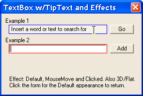



## MoMo and that kind of people \+ TxtBox w/effects\.

### Description

First, When these people spams psc with annoying posts, you get angry and give them exactly what they

want 'Feedback' Feedbacks from you is what's driving them. They want attention and this is the way they get it. If you see these postings, don't jump right into their trap (Feedback section). You should instead take a pepsi/beer or whatever, cool down and ignore it. If you do, i won't be surprised if those postings stops after a while. With no feedbacks, it won't be that fun for them anymore. To Ian: You should make a site where people can debate and leave their anger instead of the spammers feedbacksection, and you should look into it now and then to get some inputs on 'How to get rid of those people'... Anyways, this is my opinion. --&lt;&gt;

----

&lt;&gt;

----

&lt;&gt;-- Second, I have also added some code to this posting, so it won't be a waste of space :) The code shows a TextBox w/TipText and effects. Effects/looks: Default, MouseMove and Clicked. Made it for single line use only such as search or other input fields. Thanks! Regards, Jim K.
 
### More Info
 

             |
---                |---
**Submitted On**   |2005-06-17 11:32:42
**By**             |[Jim K](https://github.com/Planet-Source-Code/PSCIndex/blob/master/ByAuthor/jim-k.md)
**Level**          |Beginner
**User Rating**    |4.0 (8 globes from 2 users)
**Compatibility**  |VB 5\.0, VB 6\.0
**Category**       |[Miscellaneous](https://github.com/Planet-Source-Code/PSCIndex/blob/master/ByCategory/miscellaneous__1-1.md)
**World**          |[Visual Basic](https://github.com/Planet-Source-Code/PSCIndex/blob/master/ByWorld/visual-basic.md)
**Archive File**   |[MoMo\_and\_t1902726172005\.zip](https://github.com/Planet-Source-Code/jim-k-momo-and-that-kind-of-people-txtbox-w-effects__1-61206/archive/master.zip)

